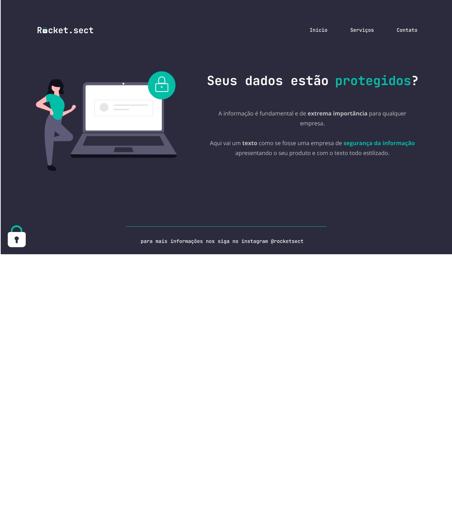

  

  

## 🖥️ Projeto
Esse é um projeto web de um modelo uma tela de apresentação de um site de uma empresa de segurança da informação.

## 🚀 Tecnologias
Esse projeto foi desenvolvido durante o curos de Explore da Rocketsat com as seguintes tecnologias:

-HTML
- CSS
-GIT E GITHUB

## 🏷️layout
Você pode visualizar o layout do projeto através 
[desse link](https://www.figma.com/file/ZKy4A2utAZotjFkqRkWN5x/Explorer-(Copy)?type=design&node-id=16-106&t=QKtBIjHoM80vW496-0).
É necessario ter uma conta no [Figma](https://www.figma.com).